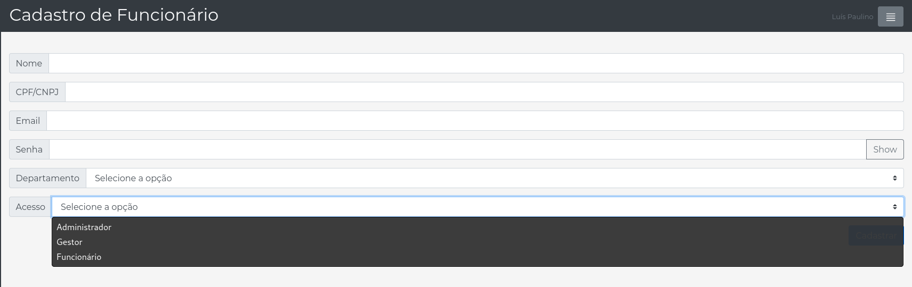

<h3 align="center">Gather é uma ferramenta de gestão de tarefas para melhorar a eficicácia das reuniões</h3>

<h4 align="center">&#x1F6A7; Projeto em construção &#x1F6A7;</h4>

<p align="center">
  

  <a href="https://github.com/ozluuh/gather/blob/main/LICENSE">
    
  </a>
</p>

## Tabela de conteúdos

- [Tabela de conteúdos](#tabela-de-conteúdos)
- [Sobre](#sobre)
- [Funcionalidades](#funcionalidades)
- [Como executar](#como-executar)
  - [Pré-requisitos](#pré-requisitos)
    - [Preparando o ambiente](#preparando-o-ambiente)
    - [Rodando a aplicação](#rodando-a-aplicação)
- [Tecnologias](#tecnologias)
- [Screenshots](#screenshots)
- [Como contribuir](#como-contribuir)
- [Autor](#autor)
- [Licença](#licença)

## Sobre

**Gather** é uma ferramenta empresarial focada na eficicácia de reuniões, colocando em pauta todas as tarefas e colaboradores designados as mesmas, evitando o esquecimento de conteúdos.

Projeto desenvolvido durante a **Challenge 2020** proposta pela **FIAP - Faculdade de Informática e Administração Paulista** em parceria com a **B2W**.

## Funcionalidades

- [x] **Acesso:** é dividido em 3 vertentes:
  - **Administrador:** responsável por gerir os acessos e departamentos;
  - **Gestor:** responsável por criar reuniões e atribuir as tarefas aos colaboradores (identificados como funcionários);
  - **Funcionário:** responsável por executar as tarefas.
- [x] **Departamento:** define os tipos de departamento disponíveis, possuindo as seguintes funcionalidades:
  - [x] **Cadastro:** onde é possível realizar o cadastro de novos departamentos;
  - [x] **Listagem:** exibe todos os departamentos criados.
  - [x] **Atualização:** sendo possível atualizar o nome do departamento;
- [x] **Funcionário:** define o usuário logado no sistema, tendo as respectivas funcionalidades atreladas:
  - [x] **Cadastro:** sendo possível realizar o cadastro dos usuários da aplicação<sup>[*]</sup>;
  - [x] **Listagem:** exibe todos os usuários cadastrados na aplicação<sup>[*]</sup>;
  - [x] **Remoção:** remove o usuário selecionado, mediante o mesmo esteja inativado no sistema<sup>[*]</sup>.
- [x] **Reunião:** sendo classificada como o objeto principal onde contém os seus objetos secundários, identificados como tarefas:
  - [x] **Cadastro:** onde é possível incluir novas reuniões<sup>[*]</sup>;
  - [x] **Listagem:** onde são visualizadas as reuniões cadastradas;
  - [x] **Atualização:** podendo alterar apenas o status das reuniões entre as seguintes<sup>[*]</sup>:
    - Pendente;
    - Concluída;
- [x] **Tarefa:** as informações detalhadas das ações que serão executadas pelo usuário designado a mesma:
  - [x] **Cadastro:** não podendo ser incluído sem estar amarrado a uma reunião;
  - [x] **Listagem:** onde são visualizadas as tarefas e seus detalhes<sup>[*]</sup>;
  - [x] **Atualização:** podendo alterar apenas o status das tarefas entre as seguintes<sup>[*]</sup>:
    - Pendente;
    - Concluída;
- [x] **Editar Perfil:** todo usuário logado tem a capacidade de alterar seu próprio perfil, exceto informações específicas como:
  - **CPF/CNPJ:** esta é requirida para fins de acesso ao sistema
  - **Acesso/Departamento/Ativo?:** apenas usuários com privilégios administrativos podem realizar essa alteração;
- [ ] **Loja:** implementação futura para bonificação de colaboradores mediante execução de tarefas atribuídas.

## Como executar

Este projeto é dividido em duas partes

1. Backend (pasta src)
2. Frontend (pasta WebContent)

Ambos rodam assim que iniciado o processo na IDE de sua escolha.

### Pré-requisitos

Antes de começar, você vai precisar ter instalado em sua máquina as seguintes ferramentas:

- **Git:** para clonar este repositório na sua máquina;
- **Java Development Kit (JDK):** para conseguir compilar e executar o projeto;
- **Apache Tomcat 9:** servidor responsável por subir a aplicação;
- **Oracle SQL ou MySQL:** banco de dados relacional, responsável por armazenar todas as informações do sistema;
- **Eclipse:** IDE utilizada para desenvolver este projeto ou qualquer outra de sua escolha.

#### Preparando o ambiente

Após instalar e configurar as ferramentas a sua escolha, no banco de dados rode o script específico para criar as tabelas necessárias para a aplicação executar:
- **MySQL:** pode ser encontrado em _./banco/ddl/mysql.sql_
- **Oracle:** pode ser encontrado em _./banco/ddl/oracle.sql_

Após criar o banco, você pode escolher a forma como vai alimentar o banco de dados, estando dividido em:
- **Essencial:** contendo apenas os dados básicos para conseguir acessar a aplicação, tendo que criar os outros dados diretamente na mesma;
- **Completo:** contém todos os dados básicos e popula todas as tabelas com mais alguns dados para visualizar a aplicação com os dados de teste;

&#x1F4A1; Ambos podem ser encontrados em _./banco/dml/<tipo_escolhido>/<banco_instalado>_.

#### Rodando a aplicação

- Clone este repositório
  ```bash
  git clone git@github.com:ozluuh/gather.git
  ```
- Abra na IDE de sua escolha
- Escolha entre uma das páginas a seguir para executar:
  - **index.jsp:** Landing page do sistema, como direcionamento para a página de login (app.jsp)
  - **app.jsp:** Página de login do sistema
- Por fim, realize os testes &#x1F603;

&#x1F4A1; O login e senha para o usuário Administrador é:
- **Login:** 84335094388
- **Senha:** admin

## Tecnologias

As seguintes ferramentas foram usadas na construção do projeto:

**Website**
- HTML5
- CSS3
- Javascript
- Bootstrap 4
- JQuery 3.5
- JSP (Java Server Pages)
- JSTL (JSP Standard Tag Library)

**Server**
- Apache Tomcat 9

**Backend**
- Java 8

**Utilitários**
- Editor: [Eclipse IDE for Enterprise Java Developers](https://www.eclipse.org/downloads/packages/)
- Ícones: [Bootstrap Icons](https://icons.getbootstrap.com/), [Feather Icons](https://feathericons.com/)
- Fontes: [Montserrat](https://fonts.google.com/specimen/Montserrat)
- Geral: [Favicon Generator](https://realfavicongenerator.net/)

## Screenshots

<figure align="center">
  
  <figcaption>Login</figcaption>
</figure>

<figure align="center">
  
  <figcaption>Troca de senha (é apresentada no primeiro login realizado na plataforma) - visão mobile</figcaption>
</figure>

<figure align="center">
  
  <figcaption>Dashboard - visão funcionário</figcaption>
</figure>

<figure align="center">
  
  <figcaption>Dashboard - visão gestor</figcaption>
</figure>

<figure align="center">
  
  <figcaption>Departamentos: listagem - visão administrador</figcaption>
</figure>

<figure align="center">
  
  <figcaption>Departamentos: atualização - visão administrador</figcaption>
</figure>

<figure align="center">
  
  <figcaption>Funcionários: listagem - visão administrador</figcaption>
</figure>

<figure align="center">
  
  <figcaption>Funcionários: cadastro - visão administrador</figcaption>
</figure>

<figure align="center">
  
  <figcaption>Funcionários: atualização - visão administrador</figcaption>
</figure>

<figure align="center">
  
  <figcaption>Reunião: cadastro - visão gestor</figcaption>
</figure>

## Como contribuir

1. Faça um **fork** do projeto.
2. Crie uma nova branch com as suas alterações: `git checkout -b minha-funcionalidade`
3. Salve as alterações e crie uma mensagem de commit contando o que você fez: `git commit -m "minha nova funcionalidade"`
4. Envie as suas alterações: `git push origin minha-funcionalidade`

## Autor

<a href="https://github.com/ozluuh" target="_blank" rel="noopener noreferrer">
  
</a>

[](www.linkedin.com/in/ozluuh)

## Licença

[MIT](./LICENSE) &copy; [Luís Paulino](https://github.com/ozluuh)

[*]: #funcionalidades 'dependendo do privigélio atribuído ao usuário realizando a ação'
